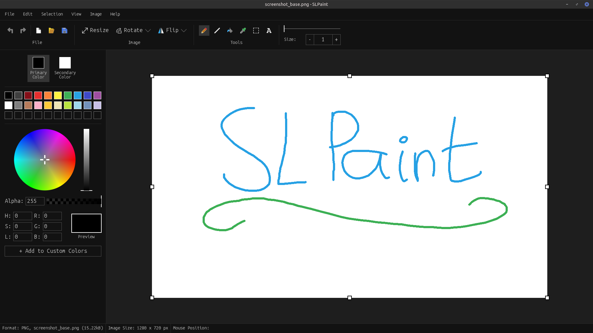

# SLPaint

SLPaint (short for Simon - Linux - Paint) is a simple image editing program for Linux,
inspired by Microsoft Paint.

I started this project in August of 2024.

SLPaint is still under development and has quite some room for improvement:
- Text input is very basic
- Text rendering is quite primitive
- There are a lot of small transparency bugs
- Icons are in an early state

*SLPaint is still in early development. There might be unexpected bugs or crashes.*

## Feature list

SLPaint supports the following features:
- Opening and saving image files (PNG, JPG and BMP formats)
- Editing images:
    - Pencil tool
    - Line tool
    - Fill bucket tool
    - Color picker tool
    - Selection tool
    - Text tool (only a single font is supported: Free Mono Bold)
- Resizing
- Flipping
- Rotating
- Cropping
- Transparency
- Color editing
- Access to system clipboard
- Undo / redo options
- RGB, HSL and HSV color formats
- Light and dark theme

## License

This project is licensed under the GPL-3.0-or-later.
See the LICENSE file for details.

This project bundles the following libraries:
- LWJGL (BSD-3-Clause)
- slickutils (BSD-style license)